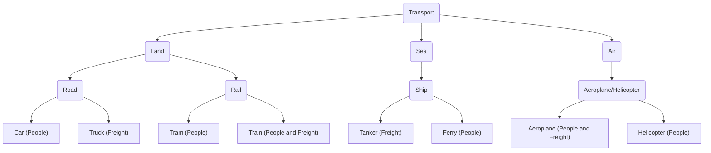

# expert-system-practical
# 🎓 شرح مسألة تمثيل المعرفة (Knowledge Representation)

أهلاً بيك! في الملف ده هنفصص المسألة بتاعة وسائل النقل دي حتة حتة، وهنحول الكلام اللي في القطعة لقواعد يفهمها الكمبيوتر.

---

## 📜 نص المسألة الأصلي

### Knowledge Representation

Consider the following passage of text about different methods of transport:

> There are three main modes of transport: land, sea and air.
> **Land-based locomotion** is either by **road** or **rail**. **Road-based locomotion** includes cars, which are designed for carrying people, and trucks, which are designed for carrying freight. Trams and trains travel on rails, with trams designed for carrying people, while trains are designed for carrying people and freight.
>
> **Sea-based locomotion** is by **ship**. Tankers are designed for carrying freight, while ferries are designed for carrying people.
>
> **Air travel** is by **aeroplane** or **helicopter**. Aeroplanes are designed for carrying people and freight, while helicopters are designed for carrying people.

### المطلوب (The Goal)

An expert system is required to classify methods of transport. How should the knowledge contained within the text be extracted and converted into production rules?

---

## 🤔 شرح المسألة ببساطة (إيه المطلوب؟)

بص يا سيدي، الحكاية كلها إننا عايزين نبني "نظام خبير" (Expert System).

**إيه هو النظام الخبير ده؟**
بالبلدي كده، هو برنامج كمبيوتر ذكي، عامل زي خبير في مجال معين (هنا المجال هو وسائل النقل). أنت بتديله شوية معلومات (Inputs) وهو بيستخدم القواعد اللي متخزنة جواه عشان يطلعلك بنتيجة أو قرار (Output).

**طيب إزاي بنعلم الكمبيوتر ده؟**
عن طريق "تمثيل المعرفة" (Knowledge Representation). يعني بنمسك المعرفة البشرية (زي الكلام اللي في القطعة اللي فوق) ونحولها لصيغة يفهمها الكمبيوتر. أشهر صيغة هي "قواعد الإنتاج" (Production Rules).

**إيه هي قواعد الإنتاج دي؟**
هي دي الطريقة اللي بنكتب بيها القواعد. بتبقى على شكل:
`IF (لو حصل شرط أو مجموعة شروط) THEN (إذن النتيجة هي كذا)`

**يبقى المطلوب مننا في المسألة دي هو:**
1.  **نقرأ القطعة كويس.**
2.  **نطلع منها المعلومات المهمة** وننظمها. (دي مرحلة استخلاص المعرفة - Knowledge Extraction).
3.  **نكتب المعلومات دي في صورة قواعد `IF...THEN...`** عشان النظام الخبير يقدر يستخدمها. (دي مرحلة تحويل المعرفة لقواعد - Conversion to Production Rules).

يعني مثلاً، لو المستخدم قال للنظام: "أنا عايز وسيلة نقل برية، بتمشي على قضبان، وبتشيل ركاب بس"، النظام المفروض يرد يقوله: "أنت تقصد الترام (Tram)". ده اللي القواعد اللي هنعملها هتساعده يعمله.

---

## 💡 طريقة الحل خطوة بخطوة

عشان تحل أي مسألة زي دي، امشي على الخطوات دي:

1.  **حدد المفاهيم الأساسية (Attributes):** اقرأ القطعة وطلع منها الأعمدة الرئيسية اللي بتوصف كل حاجة. في حالتنا دي، المفاهيم هي:
    *   **النمط (Mode):** بري، بحري، جوي (Land, Sea, Air).
    *   **طريقة الحركة (Locomotion):** على الطريق، على قضبان، بالسفن، بالطيران (Road, Rail, Ship, Aeroplane/Helicopter).
    *   **الحمولة (Cargo):** ركاب، بضاعة، أو الاتنين (People, Freight, People and Freight).
    *   **وسيلة النقل (Transport):** اسم الآلة نفسها (Car, Truck, Train, etc.).

2.  **نظم المعرفة في جدول:** دي أسهل طريقة عشان متتلخبطش. اعمل جدول وحط فيه المفاهيم اللي طلعتها كأعمدة، وابدأ املى الجدول من القطعة. كل صف في الجدول بيمثل وسيلة نقل معينة بكل خصائصها.

3.  **حول كل صف في الجدول لقاعدة (Rule):** امسك كل صف في الجدول اللي عملته وحوله لقاعدة `IF...THEN...`.
    *   الشروط اللي في `IF` هتبقى هي كل الخصائص اللي في الصف (النمط، طريقة الحركة، الحمولة).
    *   النتيجة اللي في `THEN` هتبقى هي اسم وسيلة النقل.

---

## ✅ الحل المقترح بالتفصيل

يلا نطبق الخطوات اللي قلناها فوق.

### أولاً: استخلاص وتنظيم المعرفة (الجدول)

هنلخص كل المعلومات اللي في القطعة في الجدول ده:

| وسيلة النقل (Transport)   | النمط (Mode) | طريقة الحركة (Locomotion) | الحمولة (Cargo)    |
| :------------------------ | :----------- | :------------------------ | :----------------- |
| **Car (سيارة)**           | Land         | Road                      | People             |
| **Truck (شاحنة)**         | Land         | Road                      | Freight            |
| **Tram (ترام)**           | Land         | Rail                      | People             |
| **Train (قطار)**          | Land         | Rail                      | People and Freight |
| **Tanker (ناقلة بترول)**  | Sea          | Ship                      | Freight            |
| **Ferry (عبّارة)**        | Sea          | Ship                      | People             |
| **Aeroplane (طائرة)**     | Air          | Aeroplane/Helicopter      | People and Freight |
| **Helicopter (هليكوبتر)** | Air          | Aeroplane/Helicopter      | People             |

> **ملحوظة:** طريقة الحركة (Locomotion) للطيران ممكن نعتبرها "Airborne" أو "Flying" بس عشان نلتزم بالقطعة، هي قالت "by aeroplane or helicopter" فممكن نستخدمها كفئة واحدة.

### ثانياً: تحويل المعرفة لقواعد إنتاج (Production Rules)

دلوقتي هنحول كل صف في الجدول لقاعدة. عندنا 8 وسائل نقل، يبقى هنعمل 8 قواعد.

```
Rule 1:
IF Mode is "Land"
AND Locomotion is "Road"
AND Cargo is "People"
THEN Transport is "Car".

Rule 2:
IF Mode is "Land"
AND Locomotion is "Road"
AND Cargo is "Freight"
THEN Transport is "Truck".

Rule 3:
IF Mode is "Land"
AND Locomotion is "Rail"
AND Cargo is "People"
THEN Transport is "Tram".

Rule 4:
IF Mode is "Land"
AND Locomotion is "Rail"
AND Cargo is "People and Freight"
THEN Transport is "Train".

Rule 5:
IF Mode is "Sea"
AND Locomotion is "Ship"
AND Cargo is "Freight"
THEN Transport is "Tanker".

Rule 6:
IF Mode is "Sea"
AND Locomotion is "Ship"
AND Cargo is "People"
THEN Transport is "Ferry".

Rule 7:
IF Mode is "Air"
AND Locomotion is "Aeroplane/Helicopter"
AND Cargo is "People and Freight"
THEN Transport is "Aeroplane".

Rule 8:
IF Mode is "Air"
AND Locomotion is "Aeroplane/Helicopter"
AND Cargo is "People"
THEN Transport is "Helicopter".
```

كده إحنا حولنا المعرفة النصية لمعرفة منظمة (في جدول) ثم لقواعد منطقية (Production Rules) يقدر النظام الخبير يستخدمها عشان يصنف أي وسيلة نقل بناءً على خصائصها.

---

## 📊 رسم توضيحي للمعرفة (Knowledge Graph)

عشان الصورة تبقى أوضح، دي خريطة علاقات (Graph) بتوضح هرمية المعرفة اللي استخلصناها. تقدر تستخدم الكود ده في Obsidian مع إضافة Mermaid عشان ترسمها.



---

## ✏️ مثال إضافي عشان تحله بنفسك (تدريب)

يلا وريني شطارتك بقى! خد القطعة دي وحاول تعمل نفس اللي عملناه فوق: جدول وقواعد.

**الموضوع: أنواع المحتوى الرقمي**

> There are two main types of digital content: textual and visual.
> **Textual content** can be either static, like an **article** which is designed for detailed reading, or it can be dynamic and short, like a **tweet** which is designed for quick updates.
> **Visual content** is divided into static images and dynamic videos. **Static images** include **JPEGs**, which are best for complex photos, and **GIFs**, which are used for simple animations and logos. **Dynamic videos**, such as **MP4 files**, are used for streaming longer-form content with sound.

**المطلوب:**
1.  استخلص المعرفة من القطعة دي وحطها في **جدول**. (حدد الأعمدة الأول زي: Type, Format, Purpose).
2.  حول كل صف في الجدول **لقاعدة إنتاج (Production Rule)** بصيغة `IF...THEN...`.

بالتوفيق يا بطل!
